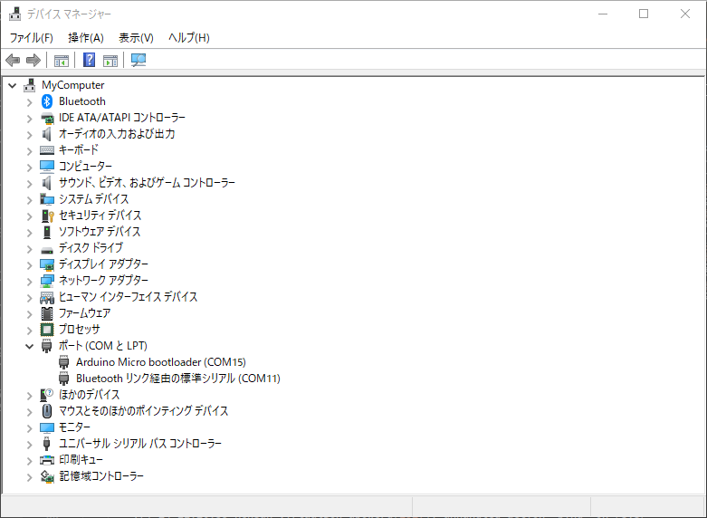
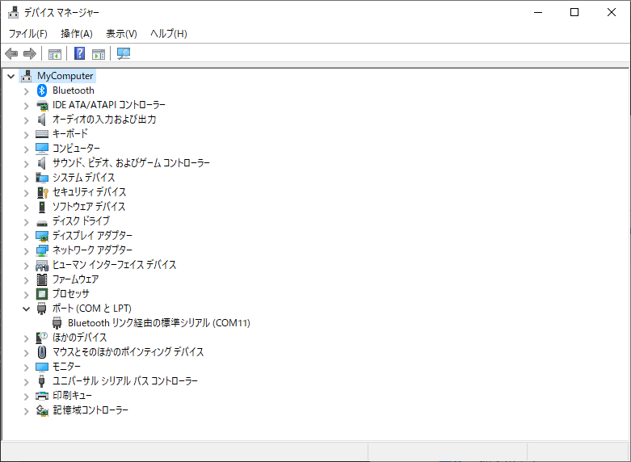

# 1. Trable shoot
qmkセットアップのトラブルシューティング
- Ubuntu 18.04(in virtualbox)
- (Ubuntu 20.04)
## 1.1. setup error 
```
$ python3 -m pip install --user qmk
```
qmkのセットアップがうまく行かない場合は以下で対応。
- try update pip
    ```sh
    $ python3 -m pip install --upgrade pip
    ```
    私の環境ではpillowのビルドで失敗した。pipが古いとそうなるみたい。

## 1.2. build error
git clone後にビルドできなかった場合は以下でセットアップ。
```
$ qmk setup
```

## 1.3. write flash error
```sh
$ make mint60:default
$ sudo make mint60:default:avrdude
```
```make mint60:default:avrdude```の後にF/W書き込みが始まるわけだが、失敗する場合がある。頭にsudoを付ける。
それでもうまく行かない場合は以下で対応。
- try change sudo setting
https://zenn.dev/noraworld/articles/sudo-path-env
- virtual box case
    - try USB setting
virtualbox ubuntuの場合、USB設定が必要。
画像のようにArduino LLC Arduino Microにチェックをつけておく

キーボードをリセット後、うまく行くと、Arduino LLCが認識される。
チェックしてもうまく行かない場合は、一度USBデバイスフィルターのArduino LLCを削除後に、もう一度リセットしてチェックする。
    - 認識されたときのログ
        ```
        $ journalctl -f 
        :
        7月 24 11:27:35 kensan-VirtualBox kernel: usb 2-2: New USB device found, idVendor=2341, idProduct=0037, bcdDevice= 0.01
        7月 24 11:27:35 kensan-VirtualBox kernel: usb 2-2: New USB device strings: Mfr=2, Product=1, SerialNumber=0
        7月 24 11:27:35 kensan-VirtualBox kernel: usb 2-2: Product: Arduino Micro   
        7月 24 11:27:35 kensan-VirtualBox kernel: usb 2-2: Manufacturer: Arduino LLC
        ;
        ```
        virtulaboxで認識されない場合はWindowsのデバイスマネージャに出てきてしまう。
        うまくいくとwindowws側には出てこなくなる。
        - **[ダメだった例]**
        
        - **[うまく行った例]**



## 1.4. reduce rom size
たったこれだけで、最適化が行われる。すごくね。
- rules.mk
```LTO_ENABLE = yes```
https://zenn.dev/koron/articles/98324ab760e83a

## 1.5. キーボードを追加する
```
$ qmk new-keyboard
```
- https://5z6p.com/2021/12/18/advent-kbd-2021/
