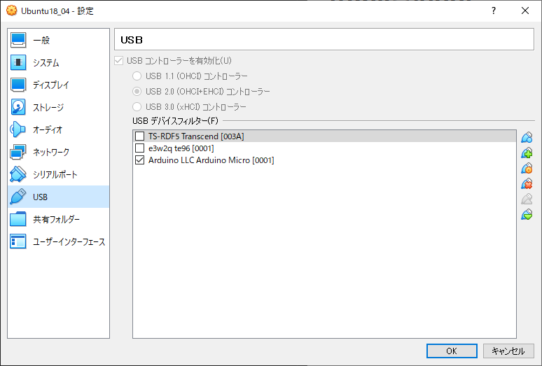

# trable shoot

## 1. setup error 
qmkのセットアップがうまく行かない場合は以下で対応。
- try update pip
    ```sh
    $ python3 -m pip install --upgrade pip
    ```
    私の環境ではpillowのビルドで失敗した。pipが古いとそうなるみたい。
## 2. write flash error
キーボードのF/W書き込みがうまく行かない場合は以下で対応。
- try change sudo setting
- virtual box case
    - try USB setting
virtualbox ubuntuの場合、USB設定が必要。
画像のようにArduino LLC Arduino Microにチェックをつけておく

キーボードをリセット後、うまく行くと、Arduino LLCが認識される。
チェックしてもうまく行かない場合は、一度USBデバイスフィルターのArduino LLCを削除後に、もう一度リセットしてチェックする。
    - 認識されたときのログ
        ```
        $ journalctl -f 
        :
        7月 24 11:27:35 kensan-VirtualBox kernel: usb 2-2: New USB device found, idVendor=2341, idProduct=0037, bcdDevice= 0.01
        7月 24 11:27:35 kensan-VirtualBox kernel: usb 2-2: New USB device strings: Mfr=2, Product=1, SerialNumber=0
        7月 24 11:27:35 kensan-VirtualBox kernel: usb 2-2: Product: Arduino Micro   
        7月 24 11:27:35 kensan-VirtualBox kernel: usb 2-2: Manufacturer: Arduino LLC
        ;
        ```
        virtulaboxで認識されない場合はWindowsのデバイスマネージャに出てきてしまう。
        うまくいくとwindowws側には出てこなくなる。
        **[ダメだった例]**
        
        **[うまく行った例]**

